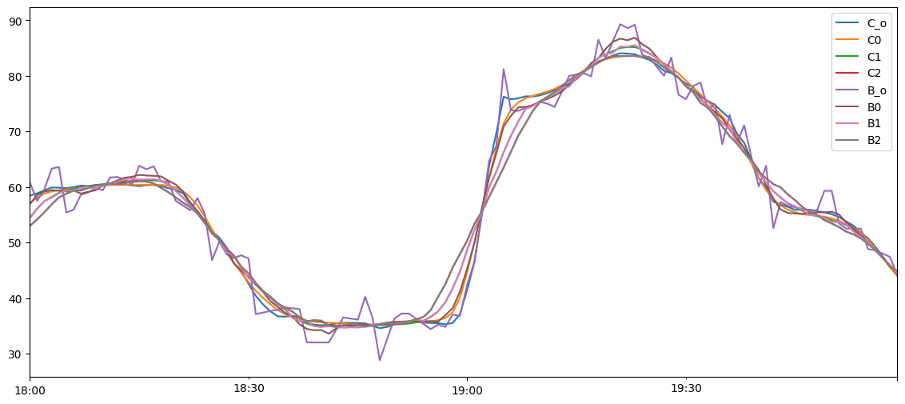

[back](../../20251015定期月總結.md)

# 穩定點

多尺度空間下沒有變動的點

SIFT 特徵點

SIFT 是英文 Scale-Invariant Feature Transform 的縮寫，中文通常叫「尺度不變特徵變換」。能在不同大小（放大、縮小）的影像中找到對應的特徵點。

$$ DoG(x, \sigma) = L(x, kh_0) - L(x, kh_0) $$

+ L 某種平滑化方法
+ h_0 調整平滑化的參數
+ DoG 不同平滑化的差值

# 資料修正

目標
+ 將穩定點間的數據簡化
+ 如果過多穩定點跳動，適度合併減少穩定點

## 數據簡化

+ 各類平滑化方法(調高平滑化程度)
	自動確保頭尾穩定點位置不變
+ 抓取重要的點做擬合
	 比如去除頭尾趨勢後，取峰谷的位置，產生擬合線

## CVXPY

**CVXPY** 是一個 **Python 的凸優化（convex optimization）建模工具包**。  
它讓你可以用「數學的方式」定義優化問題，而不用自己寫求解演算法。

換句話說：

> 你只要描述「我要最小化什麼」與「有什麼限制條件」，  
> CVXPY 會幫你自動選擇合適的求解器並給出答案。

